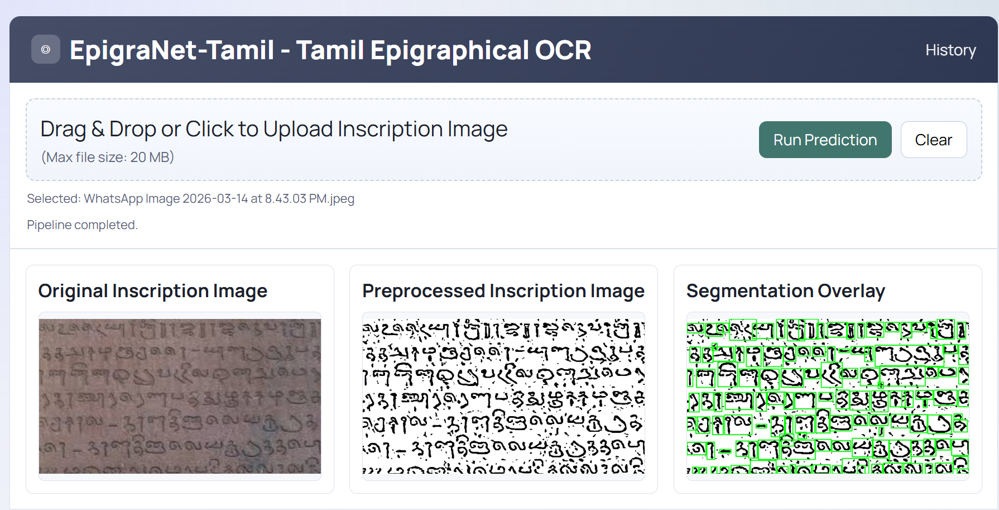
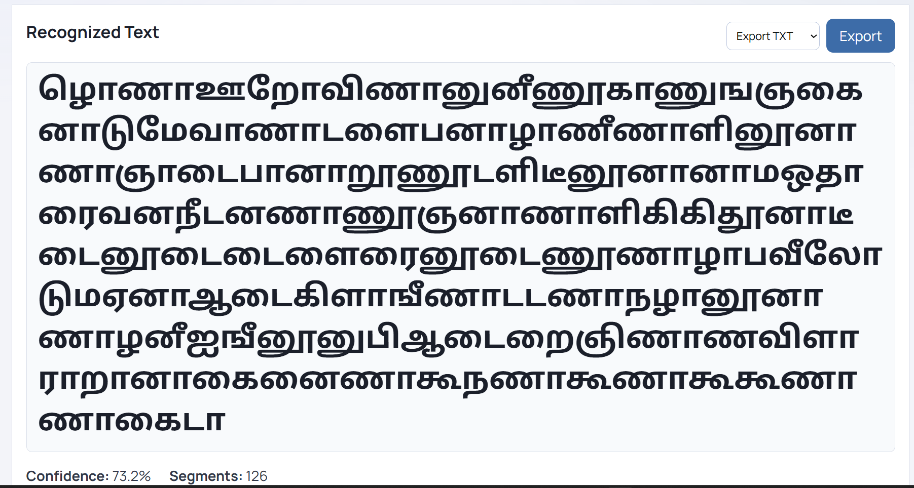
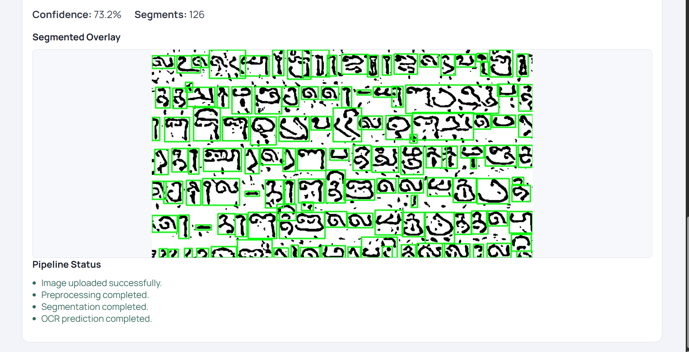
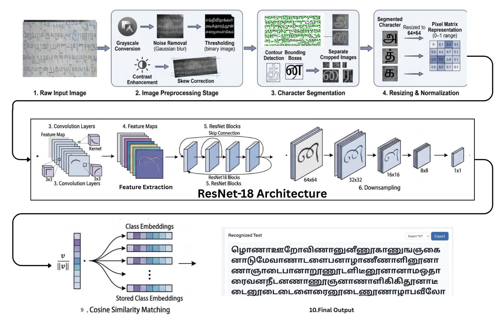
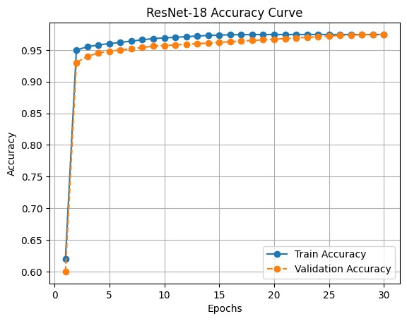
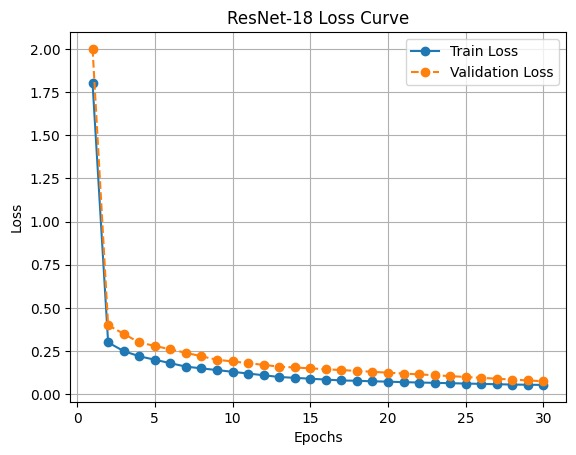
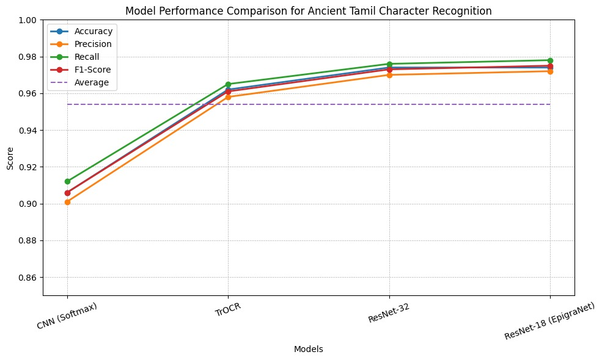

# EpigraNet-Tamil: Tamil Epigraphical OCR

## Project Overview

EpigraNet-Tamil is an OCR system for recognizing Tamil epigraphical characters from inscription images. The project combines image preprocessing, contour-based character segmentation, and an embedding-based PyTorch model to predict Tamil characters from segmented regions.

The repository includes:

- a Flask web application for browser-based OCR
- bundled model assets and reference embeddings for runtime inference
- notebooks for experimentation and workflow support
- result visuals, architecture material, and demo media

Hosted Link: [https://epigranet.onrender.com/](https://epigranet.onrender.com/)

Recognized OCR flow:

- upload an inscription image
- preprocess the image to reduce skew, noise, lines, and illumination issues
- segment characters into ROI crops
- generate embeddings and compare them with reference embeddings
- map predicted class labels to Tamil character output

## Dataset
Dataset Link: [https://drive.google.com/drive/folders/1upVeyreDrhaEtGtyFVM7sVDlJYj0Ha99?usp=sharing](https://drive.google.com/drive/folders/1upVeyreDrhaEtGtyFVM7sVDlJYj0Ha99?usp=sharing)
- **Primary dataset**: `aug_dataset/`
- **Number of classes**: `209`
- **Label mapping file**: `class_mapping_209 (1).json`
- **Reference cache**: `models/reference_embeddings.pt`

Each class is stored in its own folder inside `aug_dataset/`. At runtime, the app can use the bundled reference embedding cache directly, so the dataset is mainly required when you want to rebuild reference embeddings.

## Product Screenshots

### Main Interface


### Processing View


### OCR Output View


## Model Architecture

The OCR pipeline is organized into three major stages:

1. **Preprocessing**
   - skew correction
   - long line removal
   - denoising
   - illumination normalization
   - adaptive or Otsu binarization
   - small noise component cleanup

2. **Segmentation**
   - contour detection on the processed image
   - extraction of region-of-interest character crops
   - generation of a boxed segmentation overlay

3. **Prediction**
   - embedding generation using a PyTorch model
   - cosine similarity against stored reference embeddings
   - class-to-Tamil label mapping through `class_mapping_209 (1).json`

The runtime currently supports two model architectures:

- `resnet18`
- `tiny_cnn`

The bundled checkpoint is designed for `resnet18`, while `EPIGRANET_MODEL_ARCH=auto` allows the runtime to infer the correct architecture from the checkpoint.

### Architecture Diagram


## Results

The repository includes saved training and comparison visuals for the project.

### Accuracy


### Loss


### Model Comparison


## Sample Video

[Watch the implementation demo](implementation_photo_video/implementation-video.mp4)

## System Workflow

1. The user uploads an inscription image through the Flask interface.
2. The image is saved into the runtime-generated output folders.
3. The preprocessing pipeline corrects skew, removes long ruling lines, denoises the image, normalizes lighting, and binarizes the inscription.
4. The segmentation stage identifies character contours and stores ROI crops.
5. The OCR predictor embeds each segmented character image.
6. The embeddings are matched with stored reference embeddings using cosine similarity.
7. The predicted class IDs are converted to Tamil labels using the class mapping JSON.
8. The app returns recognized text, confidence score, segment count, and generated preview artifacts.

## Libraries Used

- **Deep Learning**: PyTorch, Torchvision
- **Image Processing**: OpenCV, Pillow, NumPy
- **Web Development**: Flask

## System Requirements

### Hardware

- **Processor**: Intel Core i5 or equivalent recommended
- **RAM**: `8 GB` or higher recommended
- **Storage**: enough space for model files, generated outputs, and optional dataset assets

### Software

- **Python**: `3.10` recommended
- **Package manager**: `pip`
- **Dependencies**: install with `pip install -r requirements.txt`

## Setup and Usage

### 1. Clone the repository

```bash
git clone https://github.com/mohanrajvijayan2410/Epigranet
cd epirgranet_implementation_full
```

### 2. Install dependencies

```bash
pip install -r requirements.txt
```

### 3. Verify required files

This repository already includes the runtime assets needed for inference:

- `models/epigranet_embedding_model (1).pt`
- `models/reference_embeddings.pt`
- `class_mapping_209 (1).json`

The `aug_dataset/` folder is optional during normal inference if `models/reference_embeddings.pt` is available.

### 4. Run the Flask application

```bash
python app.py
```

Then open:

```text
http://127.0.0.1:5000
```

### 5. Use the notebooks

The notebooks in `notebooks/` can be used for experimentation, model workflow, or Colab-based runs after setting up the main project.

The Colab workflow keeps `streamlit_app.py` in the repository because the notebook launches that file internally.

## API Endpoint

### `POST /api/predict`

Send a multipart form request with the field:

```text
image
```

Example:

```bash
curl -X POST http://127.0.0.1:5000/api/predict -F "image=@sample_inscription.jpg"
```

The API returns:

- run ID
- recognized text
- confidence score
- number of detected segments
- generated image artifact paths
- token-level predictions
- pipeline status logs

## Environment Variables

You can override local runtime paths with:

```powershell
$env:EPIGRANET_MODEL_PATH="C:\path\to\epigranet_embedding_model (1).pt"
$env:EPIGRANET_EMBEDDINGS_PATH="C:\path\to\reference_embeddings.pt"
$env:EPIGRANET_DATASET_PATH="C:\path\to\aug_dataset"
$env:EPIGRANET_CLASS_MAPPING_PATH="C:\path\to\class_mapping_209 (1).json"
$env:EPIGRANET_MODEL_ARCH="auto"
```

## Project Structure

```text
epirgranet_implementation_full/
|-- app.py
|-- streamlit_app.py
|-- pipeline.py
|-- requirements.txt
|-- class_mapping_209 (1).json
|-- models/
|   |-- epigranet_embedding_model (1).pt
|   `-- reference_embeddings.pt
|-- aug_dataset/
|-- static/
|   |-- app.js
|   `-- styles.css
|-- templates/
|   `-- index.html
|-- notebooks/
`-- implementation_photo_video/
```

## Notes

- The Flask app writes generated artifacts into `runtime_generated/` by default.
- Supported upload formats are `png`, `jpg`, `jpeg`, `bmp`, and `webp`.
- Maximum upload size is `20 MB`.
- If segmentation fails, the predictor falls back to using the full preprocessed image.
